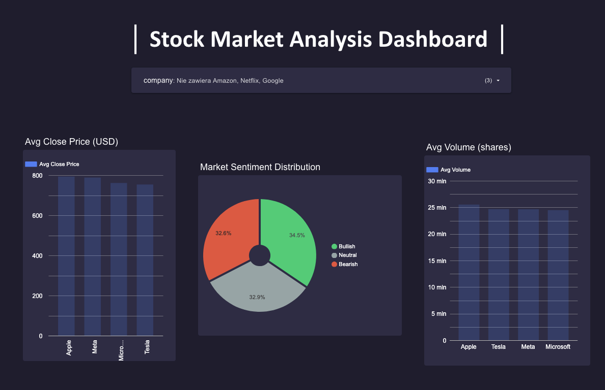

# Stock Market Analysis Dashboard

Analysis of historical stock market data for 7 major companies:
Apple, Google, Microsoft, Amazon, Tesla, Meta, and Netflix.

## Dashboard
https://datastudio.google.com/reporting/771c6d7e-3a23-443c-b698-ee7f0c4b036a

## Key Findings
- Bullish sentiment correlates with highest average daily returns
- All companies show similar average close prices (synthetic dataset)
- Market sentiment is evenly distributed: ~34% Bullish, ~33% Neutral, ~33% Bearish

## Tools Used
- Python (pandas, matplotlib, seaborn, DuckDB)
- SQL (DuckDB)
- Google Looker Studio (dashboard)

## Dataset
Source: [Kaggle — Stock Market Trends and Investor Sentiment]https://www.kaggle.com/datasets/dastgeerjutt/stock-market-trends-and-investor-sentiment

## How to Run
1. Clone the repo
2. Install dependencies: `pip install -r requirements.txt`
3. Open `notebooks/01_cleaning_eda.ipynb`
4. Run all cells
